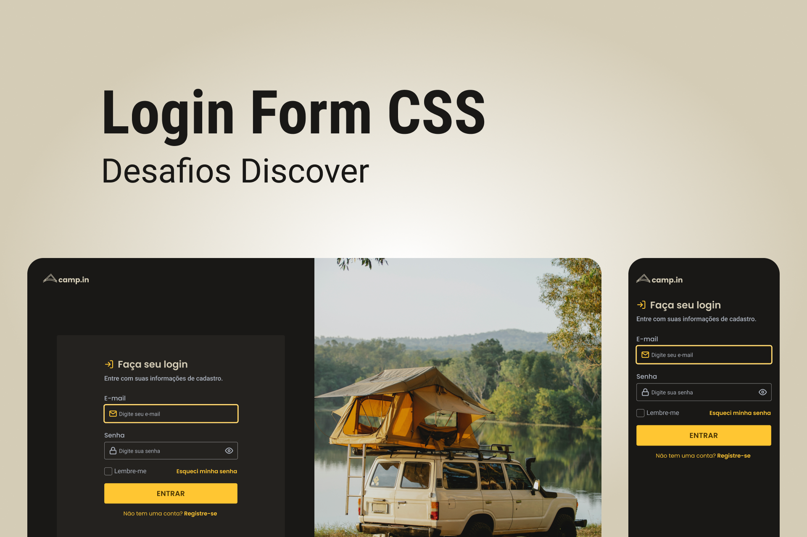

<h1 align="center">
  
</h1>

# ✅ **Requisitos**

---

O desafio do projeto é a construção de uma página para a captação de leads ou newsletter.

**Requisitos para o desafio:**

- Seguir o layout do [Figma](https://www.figma.com/file/SX8XFyC5fAY09ai8Oykz0T/DD-%2F-Login-Form---CSS/duplicate)
- Os inputs devem ter estilos diferentes dependendo do estado (normal ou em foco).
- Deixar o layout responsivo como exemplo do Figma

# 🎨 Style Guide

---

## **Cores:**

```css
:root {
  --text-base: #afb6c2;
  --text-title: #d4ccb6;
  --background: #191816;
  --form-background: #24221f;
  --primary-color: #ffc632;
}
```

## **Tipo de fonte:**

font-family: Poppins

font Weight: 400, 500 e 600

font-family: Roboto

Font Weight: 400 e 500

Você pode encontrar a fonte no [Google Fonts](https://fonts.google.com/)
